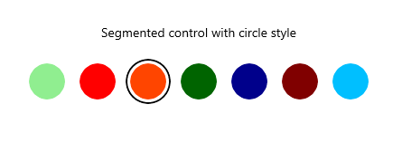
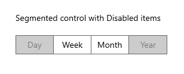
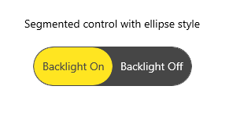
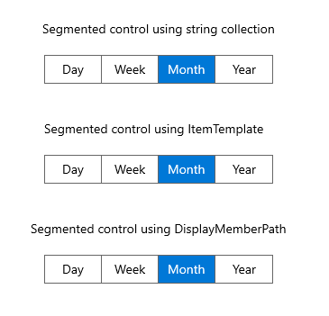
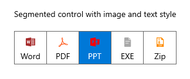
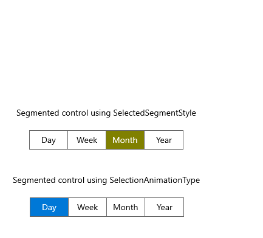
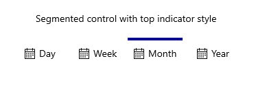
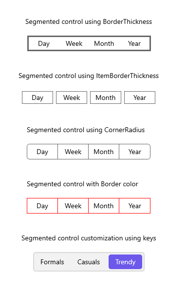
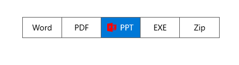
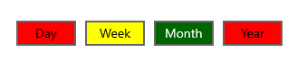

# Segmented Control - Demo Samples

This repository contains samples that demonstrate built-in functionalities and various customizations of [WinUI SegmentedControl](https://www.syncfusion.com/winui-controls/segmented-control).

* **<a href="Samples/Circle-Style">Circle Style</a>** - This demo explains how to customize the circle style using ItemContainerStyle in Segmented Control.

* **<a href="Samples/Disable-Items">Disable Items</a>** - This demo explains how to disable the items using SetItemEnabled method in Segmented Control.

* **<a href="Samples/Ellipse-Style">Ellipse Style</a>** - This demo explains how to customize the ellipse style using ItemContainerStyle in Segmented Control.

* **<a href="Samples/Getting-Started">Getting Started</a>** - This demo explains how to bind the data using both string collection and business objects.

* **<a href="Samples/Image-with-text">Image with text</a>** - This demo explains how to customize the image with text style using ItemTemplate in Segmented Control.

* **<a href="Samples/Selection-Style">Selection Style</a>** - This demo explains how to customize the selected item using both SelectedSegmentStyle and SelectionAnimationType.

* **<a href="Samples/Top-Indicator-Style">Top Indicator Style</a>** - This demo explains how to customize the top indicator style using ItemBorderThickness.

* **<a href="Samples/UI-Customization">UI Customization</a>** - This demo explains how to customize the segmented control using properties.

* **<a href="Samples/ItemTemplateSelector">ItemTemplateSelector</a>** - This demo explains how to customize the segmented control using ItemTemplateSelector property.

* **<a href="Samples/ItemContainerStyleSelector">ItemContainerStyleSelector</a>** - This demo explains how to customize the segmented control using ItemContainerStyleSelector property.

